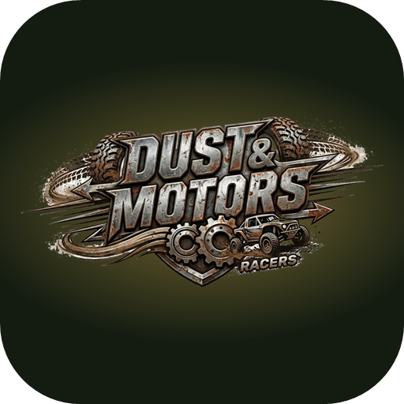

<p align="center">
  
</p>

<h1 align="center">Dust & Motors – Racers</h1>

<p align="center">
  <b>Gioco di rally 3D che si gioca nel browser, su computer e su telefono.</b><br>
  12 stage su asfalto, sterrato, ghiaia, sabbia, fango e neve, dall'alba alla notte.
</p>

<p align="center">
  
  
  
</p>

---

> [!WARNING]
> **Versione beta.** Il gioco è completo e giocabile, ma è ancora in sviluppo:
> guida, grafica, suoni e stage possono cambiare da una versione all'altra e qualche
> problema è ancora possibile. Le segnalazioni sono benvenute (vedi [Segnalare un problema](#segnalare-un-problema)).

## Gioca subito

**▶ [Apri Dust & Motors](https://karmatv80.github.io/DUST-MOTORS_Racing-beta-v0.1/)**

Codice e versioni: [github.com/KarmaTV80/DUST-MOTORS_Racing-beta-v0.1](https://github.com/KarmaTV80/DUST-MOTORS_Racing-beta-v0.1)

Non serve installare nulla: si apre nel browser. Sul telefono si può anche installare
come app (vedi [Installarlo sul telefono](#installarlo-sul-telefono)).

---

## Indice

- [Il gioco](#il-gioco)
- [Modalità di gioco](#modalità-di-gioco)
- [Gli stage](#gli-stage)
- [Le auto](#le-auto)
- [La guida](#la-guida)
- [Telecamere e replay](#telecamere-e-replay)
- [Comandi](#comandi)
- [Grafica e audio](#grafica-e-audio)
- [Installarlo sul telefono](#installarlo-sul-telefono)
- [Requisiti](#requisiti)
- [Limiti noti della beta](#limiti-noti-della-beta)
- [Struttura del progetto](#struttura-del-progetto)
- [Pubblicare e aggiornare](#pubblicare-e-aggiornare)
- [Segnalare un problema](#segnalare-un-problema)
- [Riconoscimenti](#riconoscimenti)

---

## Il gioco

Dust & Motors è un rally a tappe contro il cronometro. Si corre da soli, uno stage alla
volta, cercando di fare il tempo migliore. Ogni stage ha un tracciato, un fondo e un'ora
del giorno sempre uguali, così si può imparare la strada e migliorare.

Lungo il percorso si incontrano:

- **Tornanti e curve strette** che obbligano a frenare e a usare il freno a mano, più frequenti nei passi di montagna.
- **Ponti e gallerie**, comprese gallerie scavate nella roccia sulla costa.
- **Pozzanghere** che fanno perdere aderenza di colpo e rallentano l'auto.
- **Guard-rail, alberi, rocce, staccionate, balle di fieno** e altri ostacoli da evitare.
- **Pubblico** a bordo strada che si scansa quando l'auto si avvicina troppo.
- **Partenza e arrivo** con tribune, portale, starter con la bandiera e bandiera a scacchi.

## Modalità di gioco

| Modalità | Descrizione |
|---|---|
| **Carriera** | I 12 stage in sequenza. Conta il tempo totale e viene salvato il record migliore. |
| **Time Attack** | Si sceglie un singolo stage e si prova a battere il record di quella pista. Ogni pista ha il suo record. |

A fine stage il riquadro del risultato permette di passare allo stage successivo, riprovare,
rivedere la prova nel **replay** o scegliere un'altra pista.

Dal **Garage** si sceglie l'auto. Dalle **Opzioni** si regolano musica, effetti sonori,
risoluzione, schermo intero e comandi, e si possono azzerare i record.

## Gli stage

L'ordine della carriera:

| # | Stage | Fondo | Ora del giorno |
|---|---|---|---|
| 1 | Colline di campagna | Asfalto | Mezzogiorno |
| 2 | Sentiero nel bosco | Sterrato | Mattino |
| 3 | Cave di pietra | Ghiaia | Pomeriggio |
| 4 | Dune rosse | Sabbia | Caldo torrido |
| 5 | Periferia di notte | Asfalto bagnato | Notte |
| 6 | Altstadt München | Asfalto cittadino | Crepuscolo |
| 7 | Altopiano all'alba | Ghiaia fine | Alba |
| 8 | Palude al tramonto | Fango | Tramonto |
| 9 | Pineta al crepuscolo | Sterrato duro | Crepuscolo |
| 10 | Passo innevato | Neve | Cielo velato |
| 11 | Foresta notturna | Misto | Notte |
| 12 | Costa Brava | Asfalto di montagna | Pomeriggio |

Due stage hanno un'ambientazione particolare:

- **Altstadt München**: centro storico ispirato a Monaco di Baviera, con palazzi, strade tra
  gli isolati, pubblico, bandiere, striscioni e l'albero di maggio (Maibaum).
- **Costa Brava**: strada di montagna stretta e tortuosa in stile spagnolo, con la parete di
  roccia da un lato, lo strapiombo dall'altro e il guard-rail per tutto il percorso.

Negli stage notturni e al crepuscolo si accendono i fari dell'auto.

## Le auto

| Auto | Carattere |
|---|---|
| **Hatch WRC** | Compatta da rally moderna. |
| **Coupé Classica '70** | Coupé da rally d'epoca. |
| **Rally Raid** | Fuoristrada alto da raid. |
| **Buggy** | Buggy leggero con roll-bar a vista. |

Ogni auto ha il suo suono del motore.

## La guida

La guida è pensata per essere da rally, non da arcade:

- **Sterzo con ritardo**: bisogna anticipare la curva e impostarla prima.
- **Fondi diversi**: ogni fondo ha la sua aderenza e il suo comportamento delle gomme. Sull'asfalto
  l'auto è precisa, su sabbia, fango e neve scivola molto di più.
- **Freno a mano** per chiudere i tornanti.
- **Cambio automatico a 5 marce**, con contagiri nella barra in alto.
- **Pozzanghere**: perdita netta di aderenza, rallentamento e vibrazione.
- **Fuori pista**: l'auto rallenta, e la retromarcia è un po' più forte per tornare in strada.
- **Urti** con guard-rail e ostacoli: se l'impatto è di striscio l'auto si riallinea e prosegue.
- **Salti e atterraggi** sui dossi, con sospensioni che lavorano su ogni ruota.

## Telecamere e replay

**Cinque telecamere in gara**, da cambiare con un tasto in qualsiasi momento:

| Telecamera | Descrizione |
|---|---|
| Inseguimento | Dietro l'auto, la vista classica. |
| Inseguimento lontano | Più distante e più alta. |
| Cofano | Dal tetto, sopra il cofano. |
| Paraurti | Bassa e ampia, con molta sensazione di velocità. |
| Elicottero | Dall'alto, per leggere bene le curve. |

La telecamera scelta resta salvata anche per le partite successive.

**Replay**: a fine stage si può rivedere la prova appena fatta con una regia televisiva che
cambia inquadratura ogni pochi secondi. Ci sono telecamere fisse a bordo pista con
teleobiettivo, inseguimento, ripresa laterale, elicottero, frontale e orbita attorno all'auto.

## Comandi

### Tastiera

| Azione | Tasti |
|---|---|
| Sterzo | ← → oppure A D |
| Acceleratore | ↑ oppure W |
| Freno / retromarcia | ↓ oppure S |
| Freno a mano | Spazio |
| Cambia telecamera | C |
| Pausa | Esc oppure P |
| Conferma nei menu | Invio |

### Joypad (Xbox, PlayStation e compatibili)

| Azione | Tasti |
|---|---|
| Sterzo | Levetta sinistra oppure croce |
| Acceleratore | RT / R2 oppure A / ✕ |
| Freno / retromarcia | LT / L2 oppure B / ○ |
| Freno a mano | X / □ oppure RB / R1 |
| Cambia telecamera | Y / △ oppure View / Share |
| Pausa e conferma | Start / Options, A / ✕ |

Lo sterzo è analogico, con zona morta e curva di risposta regolabili. Se il controller la
supporta, c'è anche la vibrazione.

Tutti i tasti di tastiera e joypad si possono **riassegnare** dal menu *Comandi*. Il menu
mostra anche una diagnostica per i joypad non standard. Tutti i menu si usano con tastiera,
joypad, mouse o tocco.

### Touch (telefono e tablet)

| Zona | Funzione |
|---|---|
| Metà sinistra | **Sterzo analogico**: appoggia il pollice dove vuoi e trascina a destra o sinistra. |
| GAS / FRENO | In basso a destra. Si può far scivolare il dito da un pedale all'altro. |
| MANO | Freno a mano, sopra il gas. |
| 🎥 / ⏸ | In alto a destra: cambia telecamera e pausa. |

Il telefono va tenuto **in orizzontale**. Se lo giri in verticale durante la gara, il gioco va
in pausa. Nel replay basta un tocco per uscire. Se il telefono lo supporta, vibra negli urti.

## Grafica e audio

- **Grafica 3D** in tempo reale con three.js: ombre, nebbia, cielo e illuminazione diversi per ogni ora del giorno.
- **Texture procedurali** per strada, erba, roccia, legno, fiori e tutti gli elementi di contorno.
- **Effetti**: polvere e scie sullo sterrato, spruzzi nelle pozzanghere, segni di frenata,
  acqua delle pozzanghere, erba che si muove al vento, montagne a bordo pista negli stage di montagna e su neve.
- **Fari** con il fascio di luce che parte dai fari del modello.
- **Audio sintetizzato**: motore diverso per ogni auto, gomme che cambiano suono col fondo,
  sgommate, urti diversi per metallo, legno, pietra e altri materiali, schizzi e atterraggi.
- **Musica** a tema racing nella schermata iniziale.
- **Risoluzione regolabile**, da 540p a 4K. Su telefono parte a 720p.

## Installarlo sul telefono

Il gioco è un'**app web installabile (PWA)**. Una volta installato:

- si apre dall'icona sulla schermata Home;
- è a schermo intero, in orizzontale, senza le barre del browser;
- funziona **anche senza connessione** dopo il primo avvio.

**Android (Chrome)**: apri il link del gioco → menu **⋮** → **Installa app** oppure *Aggiungi a schermata Home*.

**iPhone / iPad (Safari)**: apri il link → tasto **Condividi** → **Aggiungi alla schermata Home**.

## Requisiti

- Un browser recente con WebGL: Chrome, Edge, Firefox o Safari.
- Connessione internet al primo avvio, per scaricare il motore 3D. Poi, con l'app installata, si gioca anche offline.
- **PC**: tastiera oppure joypad.
- **Telefono / tablet**: schermo touch. Su dispositivi meno recenti conviene abbassare la risoluzione dalle Opzioni.

## Limiti noti della beta

- **iPhone**: Safari non permette di bloccare l'orientamento. Se il telefono è in verticale,
  il gioco chiede di ruotarlo. Lo schermo intero vero si ha solo aprendo il gioco dall'icona sulla Home.
- **Prestazioni**: sui telefoni economici o vecchi gli stage più ricchi (città, foreste) possono
  scattare. Abbassare la risoluzione aiuta.
- **Record e impostazioni** sono salvati solo nel browser del dispositivo: non si sincronizzano
  tra PC e telefono e si perdono cancellando i dati del sito.
- **Equilibrio della guida**: la fisica è ancora in fase di regolazione e può cambiare tra le versioni.

## Struttura del progetto

Il gioco è un'unica pagina HTML autonoma: grafica, fisica, audio e texture sono tutti
generati dal codice, senza immagini o suoni esterni.

```
DUST-MOTORS_Racing-beta-v0.1/
├── index.html              # il gioco completo
├── manifest.webmanifest    # nome, icona, schermo intero e orientamento dell'app
├── sw.js                   # service worker: gioco offline e aggiornamenti
├── icon-192.png            # icone dell'app
├── icon-512.png
├── icon-maskable-512.png   # icona adattiva per Android
└── README.md
```

**Tecnologie**: HTML, CSS e JavaScript senza framework, [three.js](https://threejs.org/) r128
per il 3D, Web Audio API per tutti i suoni, Gamepad API per i joypad, Touch Events e Service Worker.

## Pubblicare e aggiornare

Il gioco è pubblicato con **GitHub Pages**:

1. *Settings* → *Pages* → *Branch*: `main`, cartella `/ (root)` → *Save*.
2. Dopo un paio di minuti il gioco è online su
   [karmatv80.github.io/DUST-MOTORS_Racing-beta-v0.1](https://karmatv80.github.io/DUST-MOTORS_Racing-beta-v0.1/).

Per aggiornarlo basta caricare il nuovo `index.html` al posto del vecchio. Chi ha l'app
installata riceve l'aggiornamento alla prima apertura con internet.

Per provarlo in locale serve un piccolo server web, perché il service worker non funziona
aprendo il file direttamente:

```bash
python -m http.server 8000
```

poi si apre `http://localhost:8000` nel browser.

## Segnalare un problema

Essendo una beta, ogni segnalazione aiuta. Apri una
[segnalazione (Issue)](https://github.com/KarmaTV80/DUST-MOTORS_Racing-beta-v0.1/issues/new) indicando:

- dispositivo e browser (es. *Android 14, Chrome* oppure *Windows 11, Edge*);
- stage e auto usati;
- cosa è successo e, se possibile, uno screenshot.

## Riconoscimenti

- [three.js](https://threejs.org/), motore 3D (licenza MIT).
- [Russo One](https://fonts.google.com/specimen/Russo+One), carattere del titolo (SIL Open Font License).

---

<p align="center"><sub>Dust & Motors – Racers · beta v0.1 · © KarmaTV80 · tutti i diritti riservati</sub></p>
